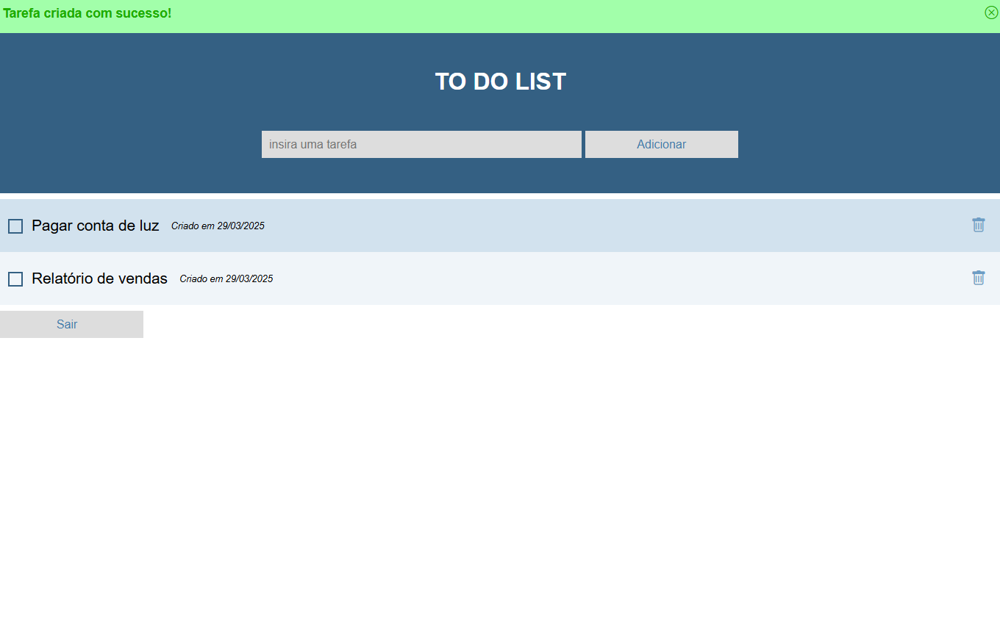

# to-do

[Veja o vídeo demonstrativo](./demo.mp4)

## Características 

- Banco de Dados MongoDB
- Formato MVC

## Ambiente de desenvolvimento

1. npm install
2. cp .env.exemple .env
3. adicionar o número da porta desejado no env
4. adicionar uri de banco mongodb no env
5. npm run dev

